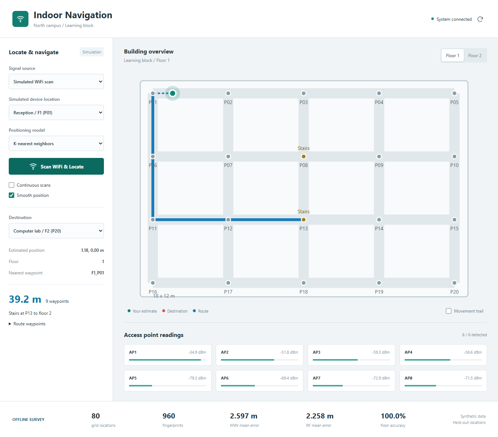

# Indoor Navigation using WiFi Fingerprinting

A complete hardware-free teaching project: simulated WiFi survey, scikit-learn positioning, FastAPI, React, and shortest-path navigation across two floors. No GPS or real WiFi scanning is used. The interface explicitly labels simulated readings.



## Quick start (Windows)

Install Python 3.11 or 3.12 and Node.js 20.19+ or 22.12+. From this repository:

```powershell
powershell -ExecutionPolicy Bypass -File .\start.ps1
```

The launcher creates a local Python environment, installs dependencies, trains models, builds React, and runs the app. Open the exact URL printed in the terminal (normally http://127.0.0.1:8080). If occupied, the server reserves the next free port. Stop it with Ctrl+C. No separate frontend server is needed.

After setup, restart quickly:

```powershell
.\.venv\Scripts\python.exe run.py
```

To prefer another port: `python run.py --port 9000`. The built interface and `/api` share that address, eliminating cross-origin browser failures.

## Manual setup (all platforms)

```bash
python -m venv .venv
# Windows: .venv\Scripts\activate
# macOS/Linux: source .venv/bin/activate
python -m pip install -r backend/requirements.txt
python -m training.generate_dataset
python -m training.train
cd frontend
npm ci
npm run build
cd ..
python run.py
```

`training.train` generates a survey only when the CSV is missing. `training.generate_dataset` explicitly replaces the CSV; do not run it over a real survey you need to keep. Regenerate and retrain together after modifying the radio simulator. Restart the server after training or rebuilding the frontend.

## Try the app

1. Select a simulated device location and KNN or Random Forest.
2. Click **Scan WiFi & Locate**. The green marker is the estimated position, not ground truth.
3. Select a destination. A blue route connects the estimate to the nearest graph node and follows valid edges.
4. Switch floors to inspect each segment. Cross-floor routes identify the stair waypoint and destination floor.
5. Enable continuous scans for fresh readings every 2.5 seconds. Movement trail displays recent estimates in this browser. Change the simulated device location to move; continuous scanning alone does not move it.

Manual RSSI mode accepts AP-ordered, comma-separated readings; `null` or a blank entry means missing. Reconnect retries metadata after a server interruption. Smoothing uses up to four readings in the current browser and resets on source, model, mode, smoothing, or predicted-floor changes.

## Project layout

```text
backend/
  main.py               FastAPI routes and built React hosting
  preprocess.py         Dataset validation and global AP alignment
  simulator.py          Shared noisy RSSI environment
  map_graph.py          Map nodes, edges, NetworkX Dijkstra
  requirements.txt      Reproducible Python dependencies
  smoke_test.py         One compact workflow check
  metrics.json          Generated held-out evaluation report
  model.pkl             Generated locally; excluded from Git
training/
  generate_dataset.py   Survey generator
  train.py              Evaluation and model serialization
data/dataset.csv        Generated sample survey, included in Git
frontend/
  src/App.jsx           Controls, smoothing and scan state
  src/FloorMap.jsx      2D floor map and route visualization
  src/api.js            Same-origin HTTP requests and errors
  src/App.css           Responsive styles
  vite.config.js        React JSX plugin and development proxy
run.py                  One-address server with free-port selection
start.ps1               Windows setup and run command
```

## Offline workflow

The default dataset contains **80 distinct locations**, 40 on each floor, and 12 repeated scans per location: **960 rows**. Eight APs generate distance-based RSSI, 15 dB inter-floor attenuation, Gaussian noise, and occasional missing readings. Detected synthetic RSSI is clipped to -90 through -30 dBm.

```csv
x,y,floor,AP1,AP2,AP3,AP4,AP5,AP6,AP7,AP8
0,0,1,-36.0,-55.0,-60.0,-57.0,,-68.0,-69.0,-74.0
```

The AP list is derived from the CSV. Missing readings become -100 dBm. Each model is a scikit-learn pipeline including a StandardScaler, so inference always applies the training transformation. The API rejects unknown AP names, nonfinite/out-of-range readings, and scans with fewer than three detected APs.

Training uses a grouped 75/25 split by `(x, y, floor)`: repeated scans at a held-out location never enter training. KNN and Random Forest predict x/y; a KNN classifier estimates floor. Mean, median, 90th-percentile horizontal errors, floor accuracy, and sample predictions are written to `backend/metrics.json`. After evaluation, deployment models are refitted on the full survey. Synthetic metrics are not a real-building accuracy guarantee; horizontal error does not include floor mistakes.

```bash
python -m training.generate_dataset --seed 42 --repeats 12
python -m training.train --dataset data/dataset.csv
```

## API examples

Interactive docs: `/docs` on the server address. Canonical endpoints use `/api`; the original `/predict`, `/route`, `/metadata`, `/scan/mock`, `/health`, `/nodes`, and `/graph` aliases also work.

`POST /api/predict`:

```json
{"signals": [-45, -60, -70, -80, -55], "model": "knn"}
```

Lists follow the AP order returned by `/api/metadata`; trailing APs are filled with -100. Named scans are also supported: `{"signals":{"AP1":-45,"AP2":-60,"AP3":-70}}`. Output shape (illustrative numbers):

```json
{"x": 4.2, "y": 6.1, "floor": 1, "node": "F1_P12", "model": "knn"}
```

`GET /api/scan/mock?node=F1_P01` generates fresh noisy signals at that node and returns the expected location separately. It never returns memorized training rows.

`POST /api/route` accepts either a graph node or coordinates:

```json
{"current_node": "F1_P01", "destination": "F2_P20"}
```

```json
{"position": {"x": 4.2, "y": 6.1, "floor": 1}, "destination": "F2_P20"}
```

The response contains `path` (node IDs), `coordinates`, `distance_m`, `connector_m`, and `transitions`. For example, routing F1_P01 to F1_P02 returns `path: ["F1_P01", "F1_P02"]` and `distance_m: 4.5`. Each stair edge has an assumed 8-meter travel length. The map is an open grid, not a surveyed architectural floor plan; replace edges with actual walkable connections for a real building. Coordinate-based routing assumes the connector to the nearest node is walkable.

## Development

```bash
python -m uvicorn backend.main:app --host 127.0.0.1 --port 8080 --reload
# Another terminal, in frontend/:
npm run dev
```

Development uses http://127.0.0.1:5180 with a `/api` proxy to port 8080. Vite fails clearly if 5180 is occupied instead of silently serving another port. The React plugin configures automatic JSX transformation. Changing backend ports in development requires updating the proxy; normal `run.py` startup requires no proxy changes.

## Minimal verification

Only a production build, one compact API workflow, and a browser scan/route check are intended. This is not an exhaustive test suite.

```bash
python -m pip install httpx
python -m backend.smoke_test
# In frontend/:
npm run build
```

## Improving accuracy

- Gather repeated real readings at denser survey points and multiple device orientations.
- Hold out survey sessions/devices as well as locations to measure generalization.
- Tune neighbor count and compare missing-signal strategies using validation data.
- Use device calibration and floor-specific positioning when radio environments differ.
- Replace the simulator with a permitted native-device scan collector, preserving AP identity and CSV columns. Browsers do not expose a general WiFi RSSI scan API.
- Model walls and walkable corridors; add a motion-aware filter and accessibility-specific routes.

Only load model pickle files you generated or trust. Models and dependencies are local; this repository contains no credentials or external service requirements.
